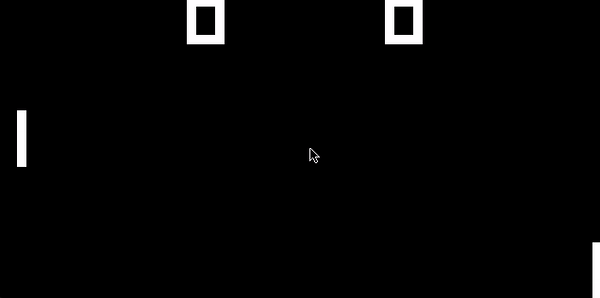

# Python Chip-8 Emulator

A Chip-8 Emulator developed in Python using PyGame. The purpose of this project was to learn about emulation and gain experience using test driven development. 



The flickering you see is an accurate emulation of Chip-8. The flickering is due to having a single draw instruction which is used for both drawing and undrawing pixels. For example, a moving paddle is first undrawn and then drawn in a new location. Since the game is essentially a free running loop, drawing can run out of sync with the refresh rate of the display causing the screen to frequently display undrawn sprites.

One potential solution to this is emulating the old phosphor displays Chip-8 games used to display on. Since the pixels of phosphor displays glow for several milliseconds after being turned off, they display a slightly dim sprite rather than a flickering one. This feature will be a future addition to this project. To see it in action check out [Faizilham's blog post](https://faizilham.github.io/revisiting-chip8) of his implementation in Rust.

## Getting Started

### Dependencies

The project dependencies you'll need to install before being able to play:

* PyGame
* Numpy

### Installing Dependencies

Installing NumPy

```
$ pip install numpy
```

Installing PyGame. A good guide for your operating system can be found on the [PyGame website](https://www.pygame.org/wiki/GettingStarted).

```
$ python3 -m pip install -U pygame --user
```

## Running the Tests

The unit tests for opcodes are located in the test_cpu.py file. Tests use the unittest library and can be run by using:

```
python3 test_cpu.py -v
```

## Running a ROM

Rom files must be placed in the "roms" directory. The emulator can be launched with a specific rom by using the following command in the root directory:

```
python3 main.py -r <rom_filename>
```

Include the -f flag to launch the emulator in fullscreen. The repository includes three games, pong.ch8, tetris.ch8 and breakout.ch8.

## Upcoming Additions

* Wait for Keypress Instruction
* Emulation of phosphor display to reduce flickering
* Keys to control emulation:
  * Speed up emulation
  * Slow down emulation
  * Pause emulator
  * Restart emulator

## Acknowledgments

* Joseph Weisbecker, the developer of Chip-8 

## Resources

* [Cowgod's Chip-8 Technical Reference](http://devernay.free.fr/hacks/chip8/C8TECH10.HTM)
* [How to Write an Emulator (Chip-8 Interpreter](http://www.multigesture.net/articles/how-to-write-an-emulator-chip-8-interpreter/)
* [Corax89's Test Rom](https://github.com/corax89/chip8-test-rom)
* [The EmuDev Subreddit](https://www.reddit.com/r/EmuDev/)
* [Faizilham's Blog](https://faizilham.github.io/revisiting-chip8)
